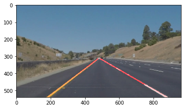
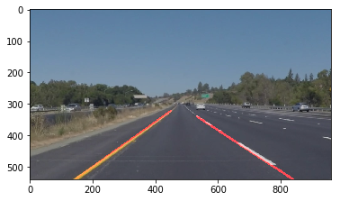
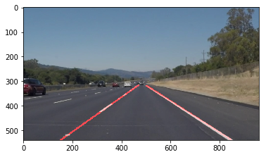
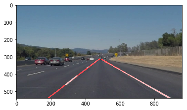
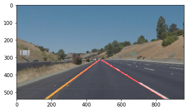
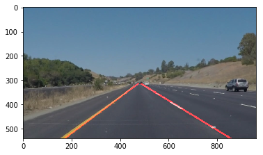

# **Finding Lane Lines on the Road** 

Goal
---

The goals / steps of this project are the following:
* Make a pipeline that finds lane lines on the road
* Reflect on your work in a written report

Reflection
---
1. Describe your pipeline. 
As part of the description, explain how you modified the draw_lines() function
For the project 1, finding lane lines on the road, my algorithm includes five steps to label the lane lines.  
1.	Transfer the color images into grayscale images.  
2.	Apply the gaussian filter on the grayscale images, the kernel size is 5.
3.	Apply the canny edge detection to find the edges.  Set the low threshold is equal to 50, and the high threshold is equal to 150.
4.	Select the region of interest.  The mask size is determined by four vertices, and the vertices position is determined by the following equations:
v1 = (0, image_height)
v2 = (image_width/2 - image_width*.01), image_height/2 + image_height*.08)
v3 = (image_width/2 + image_width*.01), image_height/2 + image_height*.08)
v4 = (image_width, image_height)
5.	Employ the Hough transform on the output images from step 4.  After trying different values of the parameter to achieve best performance (Only label the lane line clearly), the final parameter values are shown below:
rho=2
theta=np.pi/180
threshold=65
min_line_len=40
max_line_gap=250
The larger threshold and max_line_gap will lead the labeled lane line longer and less noise
Based on these five steps, I can find the position and labeled both left and right lane lines.
However, the labeled lane line is the combination of some disconnected short lines, not a continuous line.  So the draw_lines() function need to be modified and extend the labeled lane lines to be continuous long lines.  The algorithm is shown below:
•	Calculate all slope values of the lines after the Hough transform
•	Separate the left and right lines based on the sign of the slopes
•	Averaged slopes values of left and right lines separately
•	For all the left lines, finding the top points with the smallest y value.  Set that top points with smallest y value as the starting point for the left line.  Do the same thing for all the right lines, finding the starting point for the right line
•	Based on the averaged slopes and the starting point, calculate the functions of both left and right line 
•	Calculate the bottom point (End point) value, the y value of the end point is equal to the image height.  Calculate the x value of the end point based on the line function and the y value.
•	Draw the left and right lane line based on the starting and end points separately.
With the modified draw_lines() function, test the images and videos:

